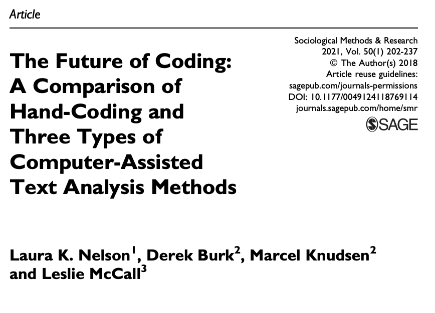

```{r setup, include=FALSE}
options(htmltools.dir.version = FALSE)

library(tidyverse)
library(tidytext)
library(quanteda)
library(here)
library(janitor)

coding_frame <- read_csv("data/coding-frame.csv")

# stopwords <- quanteda::stopwords() %>% 
#   as_tibble() %>% 
#   set_names("word")
# 
# coding_frame <- coding_frame %>% 
#   unnest_tokens(word, Description) %>%
#   anti_join(stopwords)
# 
# write_csv(coding_frame, "coding_frame_dictionary.csv")

d <- read_csv(here("data", "all-new-data.csv"))
d <- clean_names(d)
```

class: inverse, center, middle

# 1. Introductions

---

## Goals of this workshop

### Over-arching goal:

Get started with applying natural language processing methods in relatively short order through the use of R.

### Also: 

This is an opportunity to get to know and learn from one another and to build capacity in science education research to use NLP and do ML.

---

## Agenda

1. Introductions (20 min.)
2. Brief *R*efresher (20 min.)
3. Overview of core natural language processing (NLP) ideas (10 min.)

10 min. break!

4. Trying out NLP analyses, part A (25 min.)
5. Trying out NLP analyses, part B (25 min.)

10 min. break!

6. Trying out NLP analyses, part C (30 min.)
7. Learning and doing more (10 min.)
8. Wrap-up (10 min.)

---

## About me

.pull-left[
* Joshua (Josh) Rosenberg, Ph.D.
* Assistant Professor, STEM Education, [University of Tennessee, Knoxville](https://utk.edu/)
* Husband to Katie, a school librarian, and Dad to a toddler, a cyclist in training
* Research areas:
  * Science education
  * Data science education (a pedagogy)
  * Data science in education (a research approach)
     * Esp. Bayesian methods
* Former science teacher
* R user since 2014; developer of many R packages
* Presently PI or Co-PI for three National Science Foundation grants
]

.pull-right[

```{r, echo = FALSE, out.width="100%"}
knitr::include_graphics("img/joro-cycle.jpeg")
```

]

---

## Break-out rooms!

In randomly assigned break-out rooms of ~5-6 people, *starting with whomever has a 
birthday farthest from today*:

- **Introduce yourself** and your position and affiliation
- **Describe the best thing** that you have done this summer
- **What are some of your goals** for this workshop (or using natural language processing in science education!)?

---

class: inverse, center, middle

# 2. Brief *R*efresher (20 min.)

---

## Let's reason about some code

```{r, include = FALSE}
sci_data <- read_csv(here("data", "data-to-model.csv"))
```

```{r, eval = FALSE}
library(tidyverse)

sci_data <- read_csv(here("data", "data-to-model.csv"))

sci_data %>% 
  select(student_id, final_grade) %>% 
  arrange(desc(final_grade))
```

```{r}
sci_data %>% 
  select(student_id, final_grade) %>% 
  arrange(desc(final_grade))
```

What is the _data_?
What are the _functions_?
What are the _arguments_ to the functions?

And . . .

What do you think will happen?

---

```{r, eval = TRUE}
sci_data %>% 
  select(student_id, final_grade) %>% 
  arrange(desc(final_grade))
```

---

```{r, eval = FALSE}
sci_data %>% 
  group_by(subject) %>% 
  summarize(mean_final_grade = mean(final_grade, na.rm = TRUE))
```

What is the _data_?
What are the _functions_?
What are the _arguments_ to the functions?

And . . .

What do you think will happen?

---

```{r, eval = TRUE}
sci_data %>% 
  group_by(subject) %>% 
  summarize(mean_final_grade = mean(final_grade, na.rm = TRUE))
```

---

***Code Snippet A***

```{r, eval = FALSE}
sci_data %>% 
  mutate(passing_grade = if_else(final_grade >= .70, 1, 0))
```

***Code Snippet B***

```{r, eval = FALSE}
sci_data %>% 
  mutate(passing_grade = if_else(final_grade >= .70, 1, 0))
```

What is different about the two code snippets?

---

Getting Started task: https://rstudio.cloud/spaces/156192/project/2711839

---

class: inverse, center, middle

# 3. Overview of core NLP ideas (10 min.)

---

## Text is everywhere

But it is often much less-structured than the kind of data stored in tables we are used to working with
 
---

## Text as data

Text can be treated as data

---

## Input

A corpus, text with meta-data, typically in a spreadsheet format
    
---

## Key structure

**Tokenized text**

> A token is a meaningful unit of text, most often a word, that we are interested in using for further analysis, and tokenization is the process of splitting text into tokens. ([Tidy Text Mining](https://www.tidytextmining.com/tidytext.html))

```{r, echo = FALSE}
d %>% 
  unnest_tokens(word, text) %>% 
  select(student_id = id, word) %>% 
  slice(2:6) %>% 
  knitr::kable()
```

---

**Another key structure**

The _document-term_ (or document-frequency, they're the same) matrix, which uses tokenized text

```{r, echo = FALSE}
knitr::include_graphics("img/dtm.png")
```

---

## The creation of a document-term matrix involves processing

- tokenizing
- optionally removing stopwords, weighting and stemming

*Let's also review a bit on what we mean by machine learning*

---

## Defining Machine Learning (ML)

- *Artificial Intelligence (AI)*
.footnote[
[1]  I feel super uncomfortable bringing AI into this, but perhaps it's useful just to be clear about terminology
]
: Simulating human intelligence through the use of computers
- *Machine learning (ML)*: A subset of AI focused on how computers acquire new information/knowledge

This definition leaves a lot of space for a range of approaches to ML

---

## A helpful frame: Supervised & unsupervised

### Supervised ML

- Requires coded data or data with a known outcome
- Uses coded/outcome data to train an algorithm
- Uses that algorithm to **predict the codes/outcomes for new data** (data not used during the training)
- Can take the form of a *classification* (predicting a dichotomous or categorical outcome) or a *regression* (predicting a continuous outcome)
- Algorithms include:
  - [Linear regression (really!)](https://web.stanford.edu/~hastie/ElemStatLearn/)
  - Logistic regression
  - Decision tree
  - Support Vector Machine

---

## What kind of coded data?

> Want to detect spam? Get samples of spam messages. Want to forecast stocks? Find the price history. Want to find out user preferences? Parse their activities on Facebook (no, Mark, stop collecting it, enough!) (from [ML for Everyone](https://vas3k.com/blog/machine_learning/))

In science education:

- Assessment data (e.g., [1](https://link.springer.com/article/10.1007/s10956-020-09895-9))
- Data from log files ("trace data") (e.g., [1](https://www.tandfonline.com/doi/full/10.1080/10508406.2013.837391?casa_token=-8Fm2KCFJ30AAAAA%3Altbc8Y8ci_z-uLJx4se9tgvru9mzm3yqCTFi12ndJ5uM6RDl5YJGG6_4KpUgIK5BYa_Ildeh2qogoQ))
- Open-ended written (text) responses (e.g., [1](https://link.springer.com/article/10.1007/s10956-020-09889-7), [2](https://doi.org/10.1007/s11423-020-09761-w))
- Achievement data (i.e., end-of-course grades) (e.g., [1](https://link.springer.com/article/10.1007/s10956-020-09888-8), [2](https://search.proquest.com/docview/2343734516?pq-origsite=gscholar&fromopenview=true))

What else?
- Drawings/diagrammatic models
- Data collected for formative purposes (i.e., exit tickets)
- ???

---

## How is this different from regression?

The _aim_ is different, the algorithms and methods of estimation are not (or, are differences in degree, rather than in kind).

In a linear regression, our aim is to estimate parameters, such as $\beta_0$ (intercept) and $\beta_1$ (slope), and to make inferences about them that are not biased by our particular sample.

In an ML approach, we can use the same linear regression model, but with a goal other than making unbiased inferences about the $\beta$ parameters:

<h4><center>In supervised ML, our goal is to minimize the difference between a known $y$ and our predictions, $\hat{y}$</center></h3>

---

## So, how is this really different?

This _predictive goal_ means that we can do things differently:

- Multicollinearity is not an issue because we do not care to make inferences about parameters
- Because interpreting specific parameters is less of an interest, we can use a great deal more predictors
- We focus not on $R^2$ as a metric, but, instead, how accurately a _trained_ model can predict the values in _test_ data
- We can make our models very complex (but may wish to "regularize" coefficients that are small so that their values are near-zero or are zero):
  - Ridge models (can set parameters near to zero)
  - Lasso models (can set parameters to zero)
  - Elastic net models (can balance between ridge and lasso models)

---

## Okay, _really_ complex

- Okay, _really_ complex:
  - Neural networks
  - Deep networks
- And, some models can take a different form than familiar regressions:
  - *k*-nearest neighbors
  - Decision trees (and their extensions of bagged and random forests)
- Last, the modeling process can look different:
  - Ensemble models that combine or improve on ("boosting") the predictions of individual models

---

## A helpful frame: Supervised & unsupervised

### Unsupervised ML

- Does not require coded data; one way to think about unsupervised ML is that its purpose is to discover codes/labels
- Is used to discover groups among observations/cases or to summarize across variables
- Can be used in an _exploratory mode_ (see [Nelson, 2020](https://journals.sagepub.com/doi/full/10.1177/0049124118769114?casa_token=EV5XH31qbyAAAAAA%3AFg09JQ1XHOOzlxYT2SSJ06vZv0jG-s4Qfz8oDIQwh2jrZ-jrHNr7xZYL2FwnZtZiokhPalvV1RL2Bw)) 
- **Warning**: The results of unsupervised ML _cannot_ directly be used to provide codes/outcomes for supervised ML techniques 
- Can work with both continuous and dichotomous or categorical variables
- Algorithms include:
  - Cluster analysis
  - [Principle Components Analysis (really!)](https://web.stanford.edu/~hastie/ElemStatLearn/)
  - Latent Dirichlet Allocation (topic modeling)

---

## What technique should I choose?

Do you have coded data or data with a known outcome -- let's say about science students -- and, do you want to:

- _Predict_ how other students with similar data (but without a known outcome) perform?
- _Scale_ coding that you have done for a sample of data to a larger sample?
- _Provide timely or instantaneous feedback_, like in many learning analytics systems?

<h4><center>Supervised methods may be your best bet</center></h4>

Do you not yet have codes/outcomes -- and do you want to?

- _Achieve a starting point_ for qualitative coding, perhaps in a ["computational grounded theory"](https://journals.sagepub.com/doi/full/10.1177/0049124117729703) mode?
- _Discover groups or patterns in your data_ that may be of interest?
- _Reduce the number of variables in your dataset_ to a smaller, but perhaps nearly as explanatory/predictive - set of variables?

<h4><center>Unsupervised methods may be helpful</center></h4>

---

class: inverse, center, middle

# 4. Trying out NLP analyses, part A (30 min.)

---

## Structure

.pull-left[
What we'll be doing during these try it out:

- Discussing a few examples
- Running code within breakout rooms
- Sharing what we found together
]

.pull-right[

The _three_ segments will be organized around a recent, key paper: [Nelson et al. (2021)](https://www.jstor.org/stable/pdf/24572662.pdf?casa_token=_2BwFZHwOl0AAAAA:IQto4pK-kR-YEkU3zGahMgVI3dFQcG_TgV2TlyoTVkw4kG7xvkJPMIdLJF2T8m6bmsX9R_QFBQ53kcINy8jnIKf2keWi7PqzB5drP2Lj1JCubQLfNUoC):

1. Dictionary-based approaches
2. Topic modeling
3. Supervised machine learning

*These may be especially relevant to science education research*

```{r, echo = FALSE, out.width = "75%"}

```

---

## Example

**Using Twitter users profile descriptions to predict whether or not they were teachers**

- Manually coded > 500 profiles for whether they were teachers or non-teachers
- Trained a Support Vector Machine model (or algorithm) on _text features_ using 90% of the data
- For the remaining 10% of the data, we predicted whether or not someone was a teacher with an accuracy of 85%; $\kappa$ = 0.612.
- Then used the trained classifier to predict whether or not 1000s of users were or were not teachers (and used these classifications in a multi-level model)

*AERA Open*, https://journals.sagepub.com/doi/10.1177/23328584211024261

---

## What well do in part A

.pull-left[

We'll focus on two things, which build upon the other: 

1. Term frequencies
2. Dictionary-based analyses

]

.pull-right[

We'll do this in R through the use of the [{tidytext}](https://www.tidytextmining.com/tidytext.html) R package

Core ideas:

- tokenizing the text
- **counting up** words!
- joining another set of data with words and pre-determined codes (a _dictionary_)
- **counting up** the codes that are joined!

]
---

## In break-out rooms

Using the file `try-it-out-part-a.R`, work to answer one or more of the following questions:

- What do the most frequent words tell us?
- What does the dictionary-based analysis tell us?

Let's head over to the [Learning Lab in RStudio Cloud](https://rstudio.cloud/spaces/156192/projects) (and find `try-it-out-part-a.R`)!

---

class: inverse, center, middle

# 5. Trying out NLP analyses, part B (30 min.)

---

## What well do in part A

.pull-left[

We'll focus on two things, each of which builds upon the last: 

1. Topic models

]

.pull-right[

We'll do this in R through the use of the [{tidytext}](https://www.tidytextmining.com/tidytext.html) R package

Core ideas:

- 

]

---

## In break-out rooms

Using the file `try-it-out-part-b.R`, work to answer one or more of the following questions:

- How well does our model perform when we _add_ the gradebook or discussion predictors?
- What should we take away from this model and analysis, in general?

Let's head over to the [Learning Lab in RStudio Cloud](https://rstudio.cloud/spaces/156192/projects) (and find `try-it-out-part-b.R`)!

---

class: inverse, center, middle

# 6. Trying out NLP analyses, part C (30 min.)

---

## What well do in part C

.pull-left[

1. Supervised machine learning models

]

.pull-right[

Core ideas:

- Once we have coded data, we can use this data to _train_ a model that can help us to scale up our analysis

]

---

## In break-out rooms

Using the file `try-it-out-part-c.R`, work to answer one or more of the following questions:

- 

Let's head over to the [Learning Lab in RStudio Cloud](https://rstudio.cloud/spaces/156192/projects) (and find `try-it-out-part-c.R`)!

---

## Discussion of the three try it outs

- What worked well?
- For what purpose?

---
class: inverse, center, middle

# 7. Learning and doing more

---

## Learning more

- [tidymodels](https://www.tidymodels.org/)
- [Hands-on Machine Learning With R](https://bradleyboehmke.github.io/HOML/)
- [Elements of Statistical Learning](https://web.stanford.edu/~hastie/ElemStatLearn/)
- [Learning to Teach Machines to Learn](https://alison.rbind.io/post/2019-12-23-learning-to-teach-machines-to-learn/)
- [Julia Silge's blog](https://juliasilge.com/blog/)

---

## Recommendations

- Start with a problem you are facing
- Use a simple algorithm that you can understand and troubleshoot
- Be mindful of your R code; small issues (with names!) can cause difficulties
- Share and receive feedback
- Explore the variety of ways you can use machine learning; we are deciding as a field how machine learning will (or will not) make a difference in our work
- It _will be really hard at first_; you can do this!

---

class: inverse, center, middle

# 8. Wrap-up

---

## Thank you and contact information

.pull-left[
Stay in touch!

What questions do you have? What is next for you?
]

.pull-right[

Joshua Rosenberg  
jmrosenberg@utk.edu  
http://joshuamrosenberg.com/  
[@jrosenberg6432](https://twitter.com/jrosenberg6432)
]

