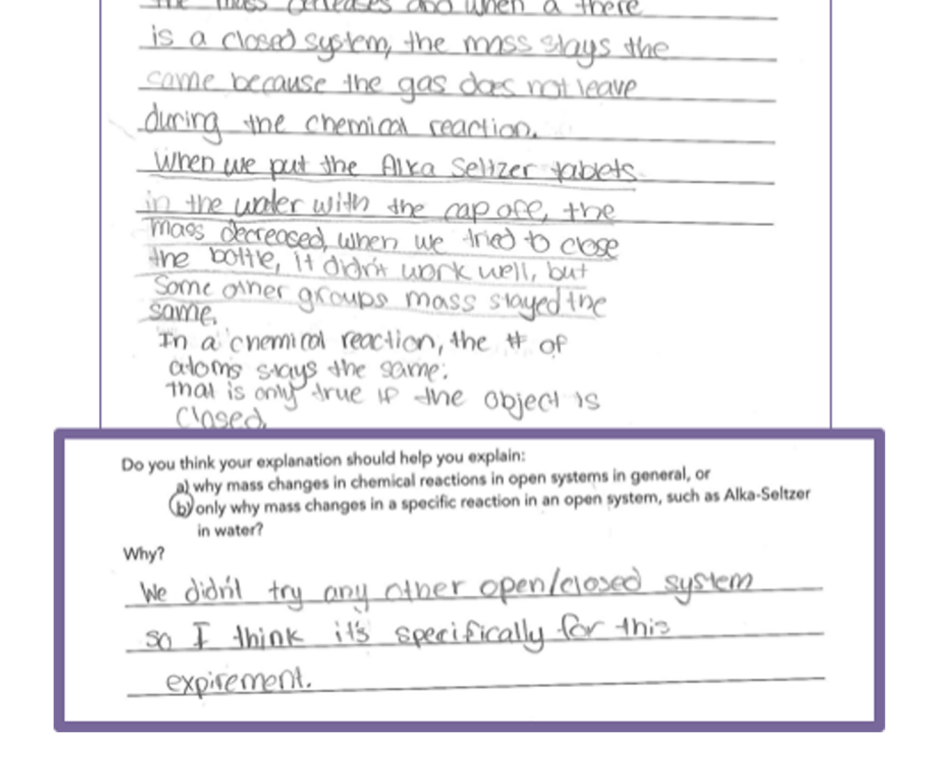
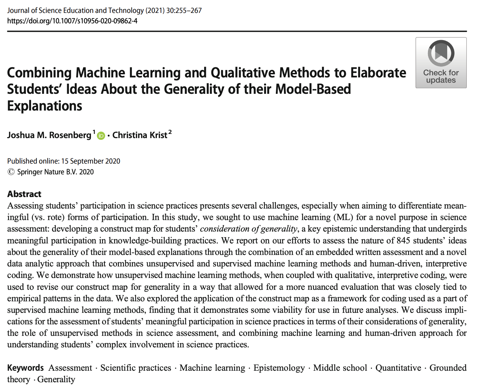
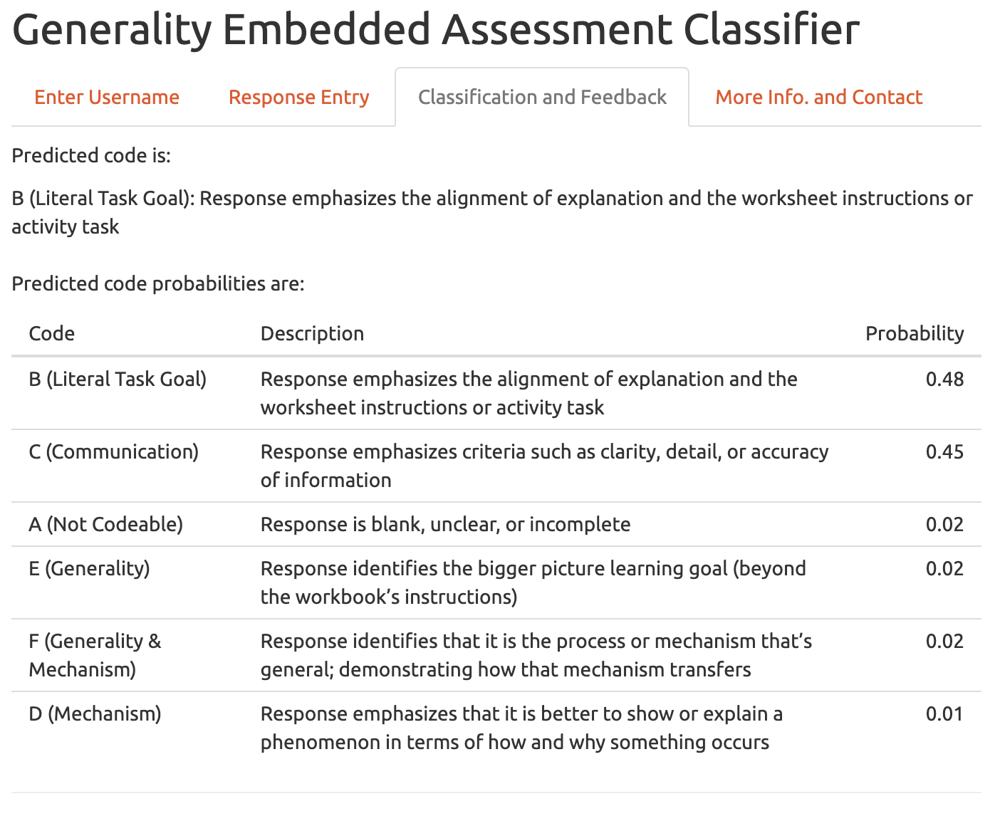

```{r setup, include=FALSE}
options(htmltools.dir.version = FALSE)

library(tidyverse)
library(tidytext)
library(quanteda)
library(here)
library(janitor)

coding_frame <- read_csv("data/coding-frame.csv")

# stopwords <- quanteda::stopwords() %>% 
#   as_tibble() %>% 
#   set_names("word")
# 
# coding_frame <- coding_frame %>% 
#   unnest_tokens(word, Description) %>%
#   anti_join(stopwords)
# 
# write_csv(coding_frame, "coding_frame_dictionary.csv")

d <- read_csv(here("data", "generality-data.csv"))
d <- clean_names(d)
```

class: inverse, center, middle

# 1. Introductions

---

## Goals of this workshop

### Over-arching goal:

Get started with applying natural language processing methods in relatively short order through the use of R.

### Also: 

This is an opportunity to get to know and learn from one another and to build capacity in science education research to use NLP and do ML.

---

## Agenda

1. Introductions (20 min.)
2. Brief *R*efresher (20 min.)
3. Overview of core natural language processing (NLP) ideas (10 min.)

10 min. break!

4. Trying out NLP analyses, part A (25 min.)
5. Trying out NLP analyses, part B (25 min.)

10 min. break!

6. Trying out NLP analyses, part C (30 min.)
7. Learning and doing more (10 min.)
8. Wrap-up (10 min.)

---

## About me

.pull-left[
* Joshua (Josh) Rosenberg, Ph.D.
* Assistant Professor, STEM Education, [University of Tennessee, Knoxville](https://utk.edu/)
* Husband to Katie, a school librarian, and Dad to a toddler, cyclist in training
* Research areas:
  * Science education
  * Data science in education
* Presently PI or Co-PI for three National Science Foundation grants (and senior personnel for [LASER](https://www.fi.ncsu.edu/projects/laser-institute/))
]

.pull-right[

```{r, echo = FALSE, out.width="100%"}
knitr::include_graphics("img/joro-cycle.jpeg")
```

]

---

## Break-out rooms!

In randomly assigned break-out rooms of ~5-6 people, *starting with whomever has the most plants*:

- **Introduce yourself** and your position and affiliation
- **Describe the most enjoyable or valuable thing** you have done this summer
- **What are some of your goals** for using _natural language processing_ in science education?

---

class: inverse, center, middle

# 2. Brief *R*efresher (20 min.)

---

## Let's reason about some code

```{r, include = FALSE}
sci_data <- read_csv(here("data", "data-to-model.csv"))
```

```{r, eval = FALSE}
library(tidyverse)

sci_data <- read_csv(here("data", "data-to-model.csv"))

sci_data %>% 
  select(student_id, final_grade) %>% 
  arrange(desc(final_grade))
```


What is the _data_?
What are the _functions_?
What are the _arguments_ to the functions?

And . . .

What do you think will happen?

---

## Let's reason about some code

```{r, eval = TRUE}
sci_data %>% 
  select(student_id, final_grade) %>% 
  arrange(desc(final_grade))
```

---

## Let's reason about some code

```{r, eval = FALSE}
sci_data %>% 
  group_by(subject) %>% 
  summarize(mean_final_grade = mean(final_grade, na.rm = TRUE))
```

What is the _data_?
What are the _functions_?
What are the _arguments_ to the functions?

And . . .

What do you think will happen?

---

## Let's reason about some code

```{r, eval = TRUE}
sci_data %>% 
  group_by(subject) %>% 
  summarize(mean_final_grade = mean(final_grade, na.rm = TRUE))
```

---

## Let's reason about some code

***Code Snippet A***

```{r, eval = FALSE}
sci_data %>% 
  mutate(passing_grade = if_else(final_grade >= .70, 1, 0))
```

***Code Snippet B***

```{r, eval = FALSE}
sci_data <- sci_data %>% 
  mutate(passing_grade = if_else(final_grade >= .70, 1, 0))
```

What is different about the two code snippets?

---

## Getting Started task

If necessary for review/questions, a link is here: https://rstudio.cloud/spaces/156192/project/2711839

---

class: inverse, center, middle

# 3. Overview of core NLP ideas (10 min.)

---

## Text is everywhere

But it is often much _less-structured_ than the kind of data stored in tables we are used to working with

```{r, echo = FALSE, out.width="75%", fig.align='center'}

```
 
---

## Treating text as data

We often need to prepare text data in a number of ways:

- Data entry (transcribing responses written with pencil and paper)
- Removing punctuation
- Removing very common words, _stopwords_
- Weighting words (e.g., *tf-idf*)
- Removing particular words or documents
- Stemming words

---

## Key structures

To consider text as data, it is necessary to structure the data in particular ways: 
  - A _corpus_: text with meta-data, often but not always in a table/spreadsheet format
  - A collection of _tokens_, usually words (but any unit of text, like a sentence)
  - a _document-frequency matrix
    
---

## Key structures

**Corpus**

```{r, echo= FALSE, message = FALSE, warning = FALSE}
library(tidytext)
d <- read_csv(here("data", "generality-data.csv"))
d <- clean_names(d) # so the names are easier to type
d <- mutate(d, unique_id = 1:nrow(d))
d <- mutate(d, code = round(code)) # this is to ignore sub-codes

my_corpus <- corpus(d)

my_corpus
```

---
## Key structures

**Tokens**

> A token is a meaningful unit of text, most often a word, that we are interested in using for further analysis, and tokenization is the process of splitting text into tokens. ([Tidy Text Mining](https://www.tidytextmining.com/tidytext.html))

```{r, echo = FALSE}
d %>% 
  unnest_tokens(word, text) %>% 
  select(student_id = id, word) %>% 
  slice(2:6) %>% 
  knitr::kable()
```

---

## Document-frequency matrix

Representing a collection of texts in a data frame / matrix format:

- rows represent documents
- columns represent the words across all documents

```{r, echo = FALSE, warning=FALSE}
dfm(my_corpus)
```

---

## Defining Machine Learning (ML)

- *Artificial Intelligence (AI)*
.footnote[
[1]  I feel super uncomfortable bringing AI into this, but perhaps it's useful just to be clear about terminology
]
: Simulating human intelligence through the use of computers
- *Machine learning (ML)*: A subset of AI focused on how computers acquire new information/knowledge

This definition leaves a lot of space for a range of approaches to ML

See the materials for the first workshop [here](https://joshuamrosenberg.com/post/2021/05/05/workshop-on-machine-learning-in-science-education-research/)

---

## A helpful frame: Supervised & unsupervised ML

### Supervised ML

- Requires coded data or data with a known outcome
- Uses coded/outcome data to train an algorithm
- Uses that algorithm to **predict the codes/outcomes for new data** (data not used during the training)
- Can take the form of a *classification* (predicting a dichotomous or categorical outcome) or a *regression* (predicting a continuous outcome)
- Algorithms include:
  - [Linear regression (really!)](https://web.stanford.edu/~hastie/ElemStatLearn/)
  - Logistic regression
  - Decision tree
  - Support Vector Machine

---

## A helpful frame: Supervised & unsupervised

### Unsupervised ML

- Does not require coded data; one way to think about unsupervised ML is that its purpose is to discover codes/labels
- Is used to discover groups among observations/cases or to summarize across variables
- Can be used in an _exploratory mode_ (see [Nelson, 2020](https://journals.sagepub.com/doi/full/10.1177/0049124118769114?casa_token=EV5XH31qbyAAAAAA%3AFg09JQ1XHOOzlxYT2SSJ06vZv0jG-s4Qfz8oDIQwh2jrZ-jrHNr7xZYL2FwnZtZiokhPalvV1RL2Bw)) 
- **Warning**: The results of unsupervised ML _cannot_ directly be used to provide codes/outcomes for supervised ML techniques 
- Can work with both continuous and dichotomous or categorical variables
- Algorithms include:
  - Cluster analysis
  - [Principle Components Analysis (really!)](https://web.stanford.edu/~hastie/ElemStatLearn/)
  - Latent Dirichlet Allocation (topic modeling)

---

## What technique should I choose?

Do you have coded data or data with a known outcome---let's say about science students---and, do you want to:

- _Predict_ how other students with similar data perform?
- _Scale_ coding that you have done for a sample of data to a larger sample?
- _Provide timely or instantaneous feedback_, e.g. learning analytics?

<h4><center>Supervised methods may be your best bet</center></h4>

Do you not yet have codes/outcomes---and do you want to?

- _Achieve a starting point_ for qualitative coding, perhaps as a part of a ["computational grounded theory"](https://journals.sagepub.com/doi/full/10.1177/0049124117729703) approach?
- _Discover groups or patterns in your data_ that may be of interest?

<h4><center>Unsupervised methods may be helpful</center></h4>

---

class: inverse, center, middle

### 10 min. break!

---

class: inverse, center, middle

# 4. Trying out NLP analyses, part A (30 min.)

---

## Structure

### What we'll be doing during these try it out

- Discussing a few examples
- Running code within breakout rooms
- Sharing what we found together

---

## Structure

### The contents of the segments

The _three_ segments will be organized around a recent, key paper: [Nelson et al. (2021)](https://www.jstor.org/stable/pdf/24572662.pdf), detailing three approaches to qualitative coding/content analysis:

1. Dictionary-based approaches
2. Topic modeling (unsupervised machine learning)
3. Supervised machine learning

*I argue these three uses are especially relevant to science education research*

```{r, echo = FALSE, out.width = "50%"}
knitr::include_graphics("img/nelson-2021.png")
```

---

## What we'll do in part A

.pull-left[

Dictionary-based analyses

Or, using a _pre-determined set of words_ to analyze text data

We use the dictionary to search for the pre-determined words in our text

Use cases:

- When the presence of particular words is very important
- For sentiment analysis

]

.pull-right[

We'll do this in R through the use of the [{tidytext}](https://www.tidytextmining.com/tidytext.html) R package

Core ideas undergirding our approach:

- tokenizing the text
- **counting up** words!
- joining another set of data with words and pre-determined codes (a _dictionary_)
- **counting up** the codes that are joined!

]
---

## But first, a brief example

```{r, echo = FALSE, out.width="80%"}

```

---

## Outline

Sought to use machine learning (ML) to develop a construct map for _students’ consideration of generality_, a key epistemic understanding that undergirds meaningful participation in _scientific practices_.

**Example of an open-ended prompt for students**

```{r, echo = FALSE, out.width="55%", fig.align='center'}

```

*We will be using students' responses to these prompts in this workshop*

---

## Coding frame

```{r, eval = FALSE}
coding_frame <- read_csv(here("data", "coding-frame.csv"))
coding_frame %>% 
  knitr::kable()
```

---

## In break-out rooms

Using the file `try-it-out-part-a.R`, work to answer the following question:

### What additions can you make to the pre-determined dictionary to improve the analysis?

Let's head over to the [Learning Lab in RStudio Cloud](https://rstudio.cloud/spaces/156192/projects) (and find `try-it-out-part-a.R`)!

---

class: inverse, center, middle

# 5. Trying out NLP analyses, part B (30 min.)

---

## What well do in part B

.pull-left[

We'll focus on topic modeling

Topic modeling involves estimating the probability of a common **topic** being composed of particular words and the probability of a document being composed of particular topics

The model is, at its core, probabilistic; there is uncertainty in both the make-up of the topics and documents

]

.pull-right[

We'll do this in R through the use of the [{quanteda}](https://quanteda.io/) and the [{topicmodels}](https://cran.r-project.org/web/packages/topicmodels/index.html) R packages

Core ideas include:

- Determining the value of _k_, the number of topics
- Interpreting the topics (consider doing so in light of the coding frame on an earlier slide)

]

---

## But first, a note

We are switching from the {tidytext} to the {quanteda} package

There are benefits to both

- Especially if you are familiar with the {tidyverse}, {tidytext} will likely be familiar
- {quanteda}, though, has additional functionality 

---

## But first

We'll focus on the use of a _document-term matrix_ 

```{r, out.width="80%", echo = FALSE}
knitr::include_graphics("img/dtm.png")
```

---
## In break-out rooms

Using the file `try-it-out-part-b.R`, work to answer the following question(s):

### **What can the topic model results tell us? What can they not?**

Let's head over to the [Learning Lab in RStudio Cloud](https://rstudio.cloud/spaces/156192/projects) (and find `try-it-out-part-b.R`)!

---

class: inverse, center, middle

### 10 min. break!

---

class: inverse, center, middle

# 6. Trying out NLP analyses, part C (30 min.)

---

## What well do in part C

.pull-left[

- Supervised machine learning

- Or, using _already-coded responses_ to train a model (to learn the relationships between _x_ variables and a _y_ variable) to apply those codes to new data

- Like for the ML models we discussed in the first workshop, there are many types of models; common models for text data include:

   - Naive Bayes
   - Support Vector Machine
   - Ridge (regularized) regression
   - Neural networks (deep learning)
   
- We can estimate all of these models through the use of the {quanteda} package

]

.pull-right[

We'll do this in R again through the use of the [{quanteda}](https://quanteda.io/) R package as well as the [{quanteda.textmodels}](https://cran.r-project.org/web/packages/quanteda.textmodels/index.html) add-on package

Core ideas include:

- We must split our data into train and test sets
- Then, we fit a model and determine how well the model performed on the test data

]

---

## But first, an example

Generality classifier: https://faast.shinyapps.io/generality-shiny/

````{r, out.width = "80%", echo = FALSE}

```

---

## One other example

**Using Twitter users profile descriptions to predict whether or not they were teachers**

- Manually coded > 500 profiles for whether they were teachers or non-teachers
- Trained a Support Vector Machine model (or algorithm) on _text features_ using 90% of the data
- For the remaining 10% of the data, we predicted whether or not someone was a teacher with an accuracy of 85%; $\kappa$ = 0.612.
- Then used the trained classifier to predict whether or not 1000s of users were or were not teachers (and used these classifications in a multi-level model)

Rosenberg et al., *AERA Open*, https://journals.sagepub.com/doi/10.1177/23328584211024261

---

## In break-out rooms

Using the file `try-it-out-part-c.R`, work to answer the following question:

### **What changes can we make to improve the performance?**

Let's head over to the [Learning Lab in RStudio Cloud](https://rstudio.cloud/spaces/156192/projects) (and find `try-it-out-part-c.R`)!

*One key note*: because we are making changes to our model based on how well it performs with the _test_ data, we would like to hold out a third sample of the data to test the performance of whichever model we select and end up using. We are not doing that for now.

---

## Returning to the Nelson (2021) paper

Nelson focused on three approaches that may be especially relevant to science education: 

1. Dictionary-based approaches
2. Topic modeling (unsupervised machine learning)
3. Supervised machine learning

```{r, echo = FALSE, out.width = "75%"}
knitr::include_graphics("img/nelson-2021.png")
```

---

## Discussion of the three try it outs

- What worked well?
- For what purpose(s)?

---
class: inverse, center, middle

# 7. Learning and doing more

---

## Learning more

NLP: 

- [quanteda documentation](https://quanteda.io/)
- [quanteda tutorials](https://tutorials.quanteda.io/machine-learning/topicmodel/)
- [tidymodels text analysis example](https://tune.tidymodels.org/articles/extras/text_analysis.html)
- [Julia Silge's blog](https://juliasilge.com/blog/)

ML:

- [Hands-on Machine Learning With R](https://bradleyboehmke.github.io/HOML/)
- [Elements of Statistical Learning](https://web.stanford.edu/~hastie/ElemStatLearn/)
- [Learning to Teach Machines to Learn](https://alison.rbind.io/post/2019-12-23-learning-to-teach-machines-to-learn/)

---

## Recommendations

- Start with a problem you are facing
- Use a simple algorithm that you can understand and troubleshoot
- Be mindful of your R code; small issues (with names!) can cause difficulties
- Share and receive feedback
- Explore the variety of ways you can use text analysis and machine learning
- Develop new approaches!

---

class: inverse, center, middle

# 8. Wrap-up

---

## Big idea

In science education, we are still figuring out how to analyze text with computers

There is room to draw upon what works in other fields (e.g., Nelson et al.'s [2021] findings)

There is also room explore and develop new _science education-specific_ approaches

---

## Critical lenses

- We should also have some degree of skepticism and pause

- See Cheuk's recent paper in _Science Education_: https://onlinelibrary.wiley.com/doi/full/10.1002/sce.21671

- What are other (downstream?) effects of using ML?

---

## Thank you and contact information

.pull-left[
Stay in touch!

What questions do you have? What is next for you?
]

.pull-right[

Joshua Rosenberg  
jmrosenberg@utk.edu  
http://joshuamrosenberg.com/  
[@jrosenberg6432](https://twitter.com/jrosenberg6432)
]
